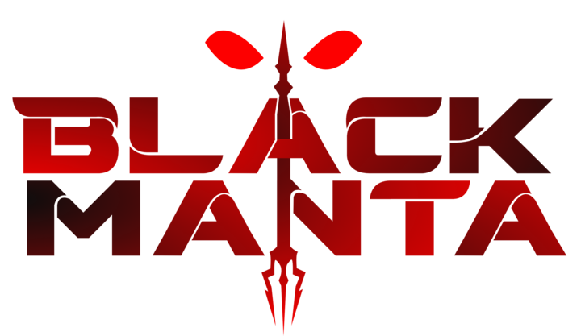
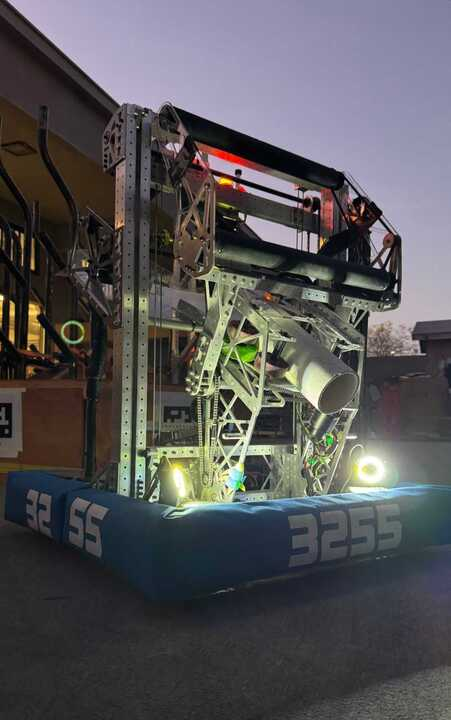
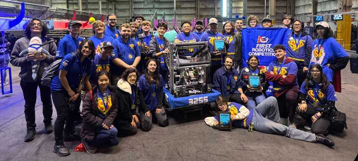
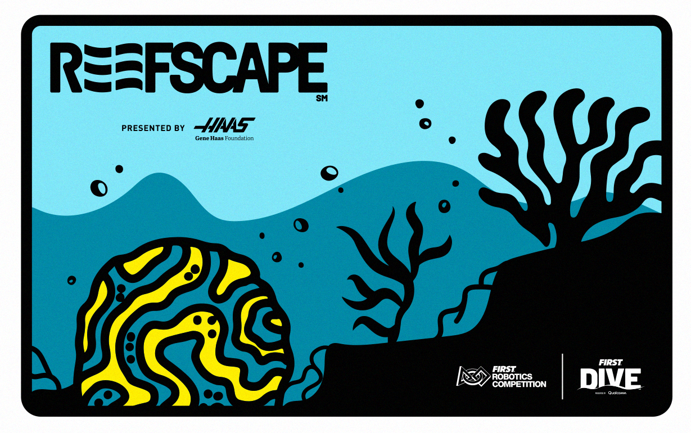
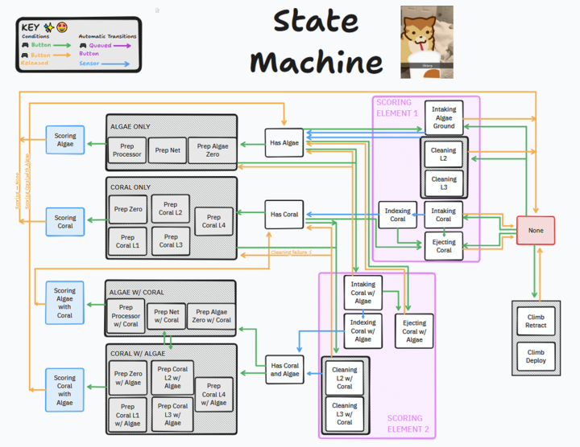
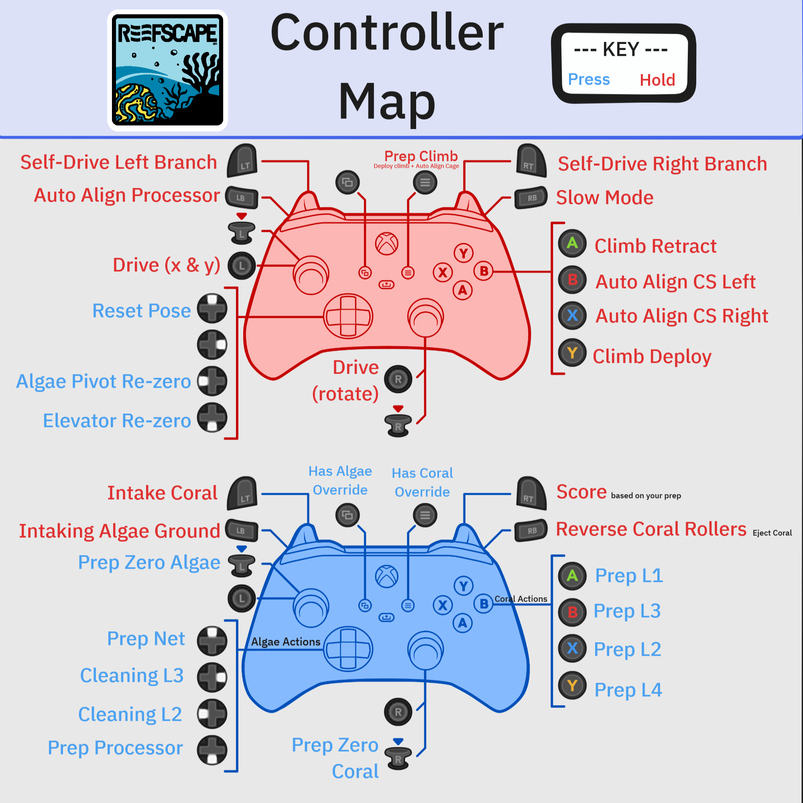

# 2025_Robot_Code - FRC Team 3255's 2025 Robot
Jump into the code [`here!`](src/main/java/frc/robot)




- 

## We won Port Hueneme Regional and Innovation In Control Award!!!!!

- 

This robot will compete at the following competitions: 
- [Port Hueneme](https://www.thebluealliance.com/event/2025caph)
- [San Diego Regional](https://www.thebluealliance.com/event/2025casd)


## View Our Robots in Action!
- [Instagram](https://www.instagram.com/frcteam3255/) 
- [YouTube (Primary)](https://www.youtube.com/@FRC3255)
- [YouTube (Clips)](https://www.youtube.com/@FRC3255Clips)
- [Build Thread (Chief Delphi)](https://www.chiefdelphi.com/t/frc-3255-supernurds-2025-build-thread/477499)
- [Website](https://supernurds.com)

## What is REEFSCAPE?


REEFSCAPE, presented by Haas, is the 2025 Season of the FIRST Robotics Competition. Each season has its unique objectives and limitations. 
Students have 6 weeks to construct a robot to compete in the season. Once the 6 weeks are up, teams compete at regional or district-level 
competitions (depending on region) to qualify for the FIRST Championship in Houston, Texas.

Interested in learning more about REEFSCAPE? Visit [FIRST's website](https://www.firstinspires.org/robotics/frc/game-and-season) for more details!

## Field Calibration
- #### Step 1: have advantage scope 3D field open whole time

-  ### Step 2: Tune the Limelights
    ## [Limelights' website](limelight.local:5801)

- #### Step 3: Check Reef


  ```  
  *Note: if the numbers of the further one doesn't work for the closer one, just use the closer one*

  a. In the advantage scope 3D field, check if the robot position is at the same position in the real life

  b. Manually position the robot to against reef face (see position 1 in photo, the robot face toward reef) 

  c. Ensure Limelights detect the April tags (you should be only see one April tag at one time)

  d. Ensure the robot is at the right position in Advantage scope 3D field 

  e. Manually move the robot back to the auto-drive location (see position 2 in the photo, with the robot facing TOWARD the reef) and check the April tag again (try to see as many April tags as you can)
 
  f. Repeat step a-e for every face of the reef 
  ```

    


-  #### Step 4: Check auto starting line 
        a. Manually move the robot on the auto starting line, make sure the robot is facing toward the center of your side of the field

       b. Ensure Limelights detect the April tags

       c. Ensure the robot is at the right position in Advantage scope 3D field 
-  #### Step 5: Coral Station
        a. Manually position the robot against the coral station, the robot face toward CS

        b. Ensure Limelights detect the April tags 

        c. Ensure the robot is at the right position in Advantage scope 3D field 

        d. Repeat step a-c for the other CS


## Software Features

### Logging & Simulation

All values, including motor outputs and logic statements, are displayed during match play and saved to the robot as a file. We have the capability of viewing these logs with a 3D model & graphs.
- **Why it’s cool:** We can translate what the robot is thinking into visuals we can understand in real time, as well as look back on previous matches to diagnose new issues.

### Manual Zeroing

We have code to manually zero the Algae Intake Pivot and Elevator. In disabled, a person can quickly zero the Algae Intake Pivot and Elevator by raising them and then hitting them into their hard stop. We display the status of our manual zeroing using the CANdle, providing a clear indicator of our zeroing status. (Red to Green)
- **Why it’s cool:** The robot will not run automatic zeroing if the manual zeroing is done to save match time. This ensures that our subsystems are at zero for every match.

### Automatic Zeroing

Our Algae Intake Pivot and Elevator automatically sets the subsystem’s zero when we enable it, making us not need an absolute encoder.
- **How it works:** The motor slowly runs to hit the mechanism to a hard stop, triggering a spike in current and a stop in velocity. We detect the current spike and velocity in code to know when the mechanism is at its hard stop to zero it correctly.
- **Why it’s cool:** Automatic zeroing serves as a fallback. If manual zeroing fails or is not completed, the robot will automatically initiate the automatic zeroing process. This ensures that our subsystems are at zero for every match.

### Vision

Using 2 Limelight 3G’s, we calculate pose estimates based on the AprilTags that each camera can see. These cameras are mounted to ensure that when we’re up against the reef (when our pose is most important), at least 1 camera can see the tag in front of us. Each Limelight’s pose estimates are then fed into the robot, passed through a rejection filter (if tags are too small or far away), and then added to a Pose Estimator that combines our current pose with the estimates.
- **Why it’s cool:** This process allows our robot to always have an accurate pose, optimized for times when minuscule changes can heavily impact cycle time. This baseline allows us to do all other vision-related features.

### Vision Aided Alignment

The multi-stage system, depending on the distance
- **Smart:** Automatically chooses which face of the reef to go 
- **Double limelights**
- **How it works:** Using the current pose of the robot (see Vision), we calculate the closest reef face on the fly. The auto alignment then determines different desired positions based on which face of the reef the driver picks, always relative to their left & right. Then, we calculate our distance from the desired pose. If the distance is too large, the robot will just turn to the correct angle; otherwise, the robot will fully self-drive to the desired position. The same process is used for Cage & Processor alignment, except there are no “left vs right” buttons; they’re just based on which is closest.

### State Machine Control

- **State Machine Diagram**


- **Controller Map**


- **State Machine link:** [State Machine](https://www.tldraw.com/ro/lFqVEhO80IajGo7JezZaz)


The state machine prevents us from going to states before the robot is ready.
- **Blocking invalid transitions through nested switch statements:** Only state transitions that meet predefined conditions are permitted, preventing the robot from entering invalid or hazardous states. The state machine subsystem manages this.
- **State Machine subsystem:** Used to manage different states in the robot. It controls which state the transitions between different states. We use enum to control what states we could go to from the current state.
- **States:** Individual commands represent different operational modes of the robot and control the robot's behavior. We set the requirements of the commands to be subStateMachine.
- **tryState method:** This method is what we run when we try to go from the current state to the desired state. It will return the desired States if it is valid based on the current state. Then it will execute the command based on the desired states.
- **Calling states:** We call the tryState method in the RobotContainer. We turn whatever it returns into a Deferred Proxy, which allows the tryState method to be evaluated multiple times.

### Scoring Elements Indexing

- **Sensor Feedback:** Real-time detection of the coral's position and status using sensors.
- **State Management:** Using Boolean variables to track the status of the coral allows the robot program to adjust based on the current state.
- **Dynamic Speed Adjustment:** The speed of coral transportation is dynamically adjusted based on sensor feedback to ensure that the coral maintains a stable position during the process. It goes faster when the coral is in the hopper, and when the sensor in the coral placer senses the coral, it slows down.
- **Consistency:** Maintaining consistent indexing logic regardless of task details, ensuring high success rates and efficiency in every mission.

### Coral Placing Safety Time

A mechanism that sets a safety delay after placing coral to ensure the robot does not immediately perform other operations (such as lowering the elevator), thereby preventing a shallow climb on the reef.
- **How it works:**
  - **Quick Tap:** If the operator performs a quick tap on the trigger button, the robot will wait until the coral has completely exited the scoring mechanism (CoralOuttake) before lowering the elevator. This process is achieved through the Coral Placing Safety Time, ensuring that the robot does not proceed to the next operation until the coral is fully placed.
  - **Long Press:** If the operator holds the trigger button for longer than the preset delay time, the robot will ignore the safety delay. This means the robot will immediately proceed to the next operation when the operator releases the trigger button.

### Motion Magic

Our Elevator & Algae Pivot use a motion profiling system from CTRE called Motion Magic, allowing us to tune not only our subsystems’ PID controller, but also their acceleration & cruise velocity.
- **Why it’s cool:** This method of tuning allows our Elevator to reach its desired position (from Min to Max) in 1.2 seconds or less, and our Algae Pivot in 1.8 seconds.

### Autos

We have 3-L4-coral-auto on both sides of the field.
- **How it works:**
  - **Driving:**
    - Basic driving: Path planner used to navigate by preset trajectories.
    - Pose Target driving: dynamically adjusts robot pose to auto-align (same as the one in tele-op).
  - **Commands:** State-machine-based command sequence scheduling ensures smooth and reliable execution.
