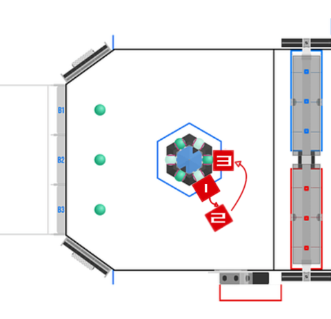

# 2025_Robot_Code - FRC Team 3255's 2025 Robot
Jump into the code [`here!`](src/main/java/frc/robot)

## Winner of Port Hueneme Regional and Innovation In Control Award
**To Watch Our Port Hueneme Regional Recap [Click Here!](https://www.youtube.com/watch?v=wBRe15c5S4I)**
 
 

 

## Winner of San Diego Regional and Gracious Professionalism Award
**To Watch Our San Diego Regional Recap [Click Here!](https://youtu.be/Qmp8hHGo8Fs?si=mEE1UkDhzCBtK5RI)**
 
 

 

## First pick of Alliance 7 in World Championship Daly Division
**To Watch Our World Championship Recap [Click Here!](https://youtu.be/pgZlrYAgXeg?si=jCeNsdmj5ZAc5a_d)**
 
 

This robot competed at the following competitions: 
- [Port Hueneme](https://www.thebluealliance.com/event/2025caph)
- [San Diego Regional](https://www.thebluealliance.com/event/2025casd)
- [Championship in Houston, TX](https://www.thebluealliance.com/event/2025cmptx)

## ✨ Highlights ✨  

- Manual & Automatic Zeroing
- Vision Aided Alignment
- State Machine
- Smart Control of Scoring Elements

## View Our Robots in Action!
- [Instagram](https://www.instagram.com/frcteam3255/) 
- [YouTube (Primary)](https://www.youtube.com/@FRC3255)
- [YouTube (Clips)](https://www.youtube.com/@FRC3255Clips)
- [Build Thread (Chief Delphi)](https://www.chiefdelphi.com/t/frc-3255-supernurds-2025-build-thread/477499)
- [Website](https://supernurds.com)

## What is REEFSCAPE?

REEFSCAPE, presented by Haas, is the 2025 Season of the FIRST Robotics Competition. Each season has its unique objectives and limitations. 
Students have 6 weeks to construct a robot to compete in the season. Once the 6 weeks are up, teams compete at regional or district-level 
competitions (depending on region) to qualify for the FIRST Championship in Houston, Texas.

Interested in learning more about REEFSCAPE? Visit [FIRST's website](https://www.firstinspires.org/robotics/frc/game-and-season) for more details!

## Software Features

### Logging & Simulation

All values, including motor outputs and logic statements, are displayed during match play and saved to the robot as a file. We have the capability of viewing these logs with a 3D model & graphs.
- **Why it’s cool:** We can translate what the robot is thinking into visuals we can understand in real time, as well as look back on previous matches to diagnose new issues.

- **Example of our logging for our TalonFXs:** [`TalonFXLogger.java`](https://github.com/FRCTeam3255/2025_Robot_Code/blob/26d6f1e49594b345b34e01dcde61f79d4eecd758/src/main/java/frc/robot/loggers/TalonFXLogger.java#L1-L32)

### Manual Zeroing

We have code to manually zero the Algae Intake Pivot and Elevator. In disabled, a person can quickly zero the Algae Intake Pivot and Elevator by raising them and then hitting them into their hard stop. We display the status of our manual zeroing using the CANdle, providing a clear indicator of our zeroing status (Red to Green).
- **Why it’s cool:** The robot will not run automatic zeroing if the manual zeroing is done to save match time. This ensures that our subsystems are at zero for every match.

- Example of our Manual Zeroing: [`ManualZeroElevator.java`](https://github.com/FRCTeam3255/2025_Robot_Code/blob/26d6f1e49594b345b34e01dcde61f79d4eecd758/src/main/java/frc/robot/commands/Zeroing/ManualZeroElevator.java#L1-L97)

### Automatic Zeroing

Our Algae Intake Pivot and Elevator automatically sets the subsystem’s zero when we enable it, making us not need an absolute encoder.
- **How it works:** The motor slowly runs to hit the mechanism to a hard stop, triggering a spike in current and a stop in velocity. We detect the current spike and velocity in code to know when the mechanism is at its hard stop to zero it correctly.
- **Why it’s cool:** Automatic zeroing serves as a fallback. If manual zeroing fails or is not completed, the robot will automatically initiate the automatic zeroing process. This ensures that our subsystems are at zero for every match.

- Example of our Automatic Zeroing: [`ZeroElevator.java`](https://github.com/FRCTeam3255/2025_Robot_Code/blob/26d6f1e49594b345b34e01dcde61f79d4eecd758/src/main/java/frc/robot/commands/Zeroing/ZeroElevator.java#L1-L82)

### Vision

Using three Limelight 3G’s, we calculate pose estimates based on the AprilTags that each camera can see. Two of the front cameras are mounted to ensure that when we’re up against the reef (when our pose is most important), at least 1 camera can see the tag in front of us. After San Diego Regional, we added a third Limelight on the back of our robot to be able to see processor tags. This ensures us to also be able to do the net and processor self-aligning.
Each Limelight’s pose estimates are then fed into the robot, passed through a rejection filter (if tags are too small or far away), and then added to a Pose Estimator that combines our current pose with the estimates. 

- **Why it’s cool:** This process allows our robot to always have an accurate pose, optimized for times when minuscule changes can heavily impact cycle time. This baseline allows us to do all other vision-related features.

- Example of our Vision: [`Vision.java`](https://github.com/FRCTeam3255/2025_Robot_Code/blob/26d6f1e49594b345b34e01dcde61f79d4eecd758/src/main/java/frc/robot/subsystems/Vision.java#L1-L154)

### Vision Aided Alignment

The multi-stage system, depending on the distance
- **Smart:** Automatically chooses which face of the reef to go 
- **Double limelights**

#### Reef Vision Aided Alignment
- **How it works:** Using the current pose of the robot (see Vision), we calculate our desired reef face on the fly based on our distance from the reef and current rotation. The self alignment then determines different desired positions based on which branch of the reef the driver picks, always relative to their left & right. Then, we calculate our distance from the desired pose. If the distance is too large, the robot will just turn to the correct angle; otherwise, the robot will fully self-drive to the desired position. 

#### Net/Processor Vision Aided Alignment

- **How it works:** Similar to the reef, we calculate the closest position of the net and processor alignment, except there are no “left vs right” buttons; they’re just based on which is closest.
However, the net and processor have a special type of alignment. We can self-align to a vertical/horizontal axis where you can score, and the driver can still move along the line. For example, for the net, we lock the drivetrain y velocity (relative to the robot) but the driver can still travel along the x-axis.

- Example of our Poses coordinates: [`Constants.java`](https://github.com/FRCTeam3255/2025_Robot_Code/blob/26d6f1e49594b345b34e01dcde61f79d4eecd758/src/main/java/frc/robot/Constants.java#L580-L717)

- Example of our vision autoalignment: [`Drivetrain.java`](https://github.com/FRCTeam3255/2025_Robot_Code/blob/main/src/main/java/frc/robot/subsystems/Drivetrain.java#L288)

### State Machine Control

**Controller Map**
  

  

**State Machine Diagram**
  

  

- **State Machine link:** [State Machine](https://www.tldraw.com/ro/lFqVEhO80IajGo7JezZaz)

- Example of our Statemachine subsystem: [`StateMachine.java`](https://github.com/FRCTeam3255/2025_Robot_Code/blob/main/src/main/java/frc/robot/subsystems/StateMachine.java)

 

The state machine prevents us from going to states before the robot is ready.
- **Blocking invalid transitions through nested switch statements:** Only state transitions that meet predefined conditions are permitted, preventing the robot from entering invalid or hazardous states. The state machine subsystem manages this.
- **[State Machine subsystem](https://github.com/FRCTeam3255/2025_Robot_Code/blob/main/src/main/java/frc/robot/subsystems/StateMachine.java):** Used to manage different states in the robot. It controls which state the transitions between different states. We use enum to control what states we could go to from the current state.
- **[States](https://github.com/FRCTeam3255/2025_Robot_Code/blob/main/src/main/java/frc/robot/subsystems/StateMachine.java#L607):** Individual commands represent different operational modes of the robot and control the robot's behavior. We set the requirements of the commands to be subStateMachine.
- **[tryState method](https://github.com/FRCTeam3255/2025_Robot_Code/blob/main/src/main/java/frc/robot/subsystems/StateMachine.java#L132):** This method is what we run when we try to go from the current state to the desired state. It will return the desired States if it is valid based on the current state. Then it will execute the command based on the desired states.
- **[Calling states](https://github.com/FRCTeam3255/2025_Robot_Code/blob/main/src/main/java/frc/robot/RobotContainer.java#L118):** We call the tryState method in the RobotContainer. We turn whatever it returns into a Deferred Proxy, which allows the tryState method to be evaluated multiple times.

### Scoring Elements Indexing

- **Sensor Feedback:** Real-time detection of the coral's position and status using sensors.
- **State Management:** Using Boolean variables to track the status of the coral allows the robot program to adjust based on the current state.
- **Dynamic Speed Adjustment:** Prior to SDR, we used to have our speed of coral transportation dynamically adjusted based on sensor feedback to ensure that the coral maintains a stable position during the process. It goes faster when the coral is in the hopper, and when the sensor in the coral placer senses the coral, it slows down.
With the addition of the coral hardstop after PHR, we no longer have to slow down the indexing speed and now just set both indexing and intaking to full speed.
- **Consistency:** Maintaining consistent indexing logic regardless of task details, ensuring high success rates and efficiency in every mission.

- Example of our indexing state: [`IndexingCoral.java`](https://github.com/FRCTeam3255/2025_Robot_Code/blob/main/src/main/java/frc/robot/commands/states/first_scoring_element/IndexingCoral.java)

### Coral Placing Safety Time

- **What it is** A mechanism that sets a safety delay after placing coral to ensure the robot does not immediately perform other operations (such as lowering the elevator), thereby preventing a shallow climb on the reef.
- **How it works:**
  - **Quick Tap:** If the operator performs a quick tap on the trigger button, the robot will wait until the coral has completely exited the scoring mechanism (CoralOuttake) before lowering the elevator. This process is achieved through the Coral Placing Safety Time, ensuring that the robot does not proceed to the next operation until the coral is fully placed.
  - **Long Press:** If the operator holds the trigger button for longer than the preset delay time, the robot will ignore the safety delay. This means the robot will immediately proceed to the next operation when the operator releases the trigger button.

- Example of our shooting delay: [`ScoringCoral.java`](https://github.com/FRCTeam3255/2025_Robot_Code/blob/main/src/main/java/frc/robot/commands/states/scoring/ScoringCoral.java#L50)

### Motion Magic 🪄🪄

Our Elevator & Algae Pivot use a motion profiling system from CTRE called Motion Magic, allowing us to tune not only our subsystems’ PID controller, but also their acceleration & cruise velocity.
- **Why it’s cool:** This method of tuning, along with our constant force springs, allows our Elevator to reach its desired position (from Min to Max) in approximately 0.79 seconds.
The addition of constant force springs after San Diego Regional allowed us to achieve a 34.6% faster cycle time on our Elevator via dynamic acceleration curves.

### Autos

Our autos include a 3 coral auto on both sides, 4 one coral and 2.5 algae net auto, and “Tickle” autos that bump other bots (forcing the ranking point).
- **How it works:**
  

  
  - **Driving:**
    - Basic driving: Path planner used to navigate by preset trajectories.
    - Pose Target driving: dynamically adjusts robot pose to auto-align (same as the one in tele-op).
  - **Commands:** State-machine-based command sequence scheduling ensures smooth and reliable execution.

  **Autos Sheet**

## Field Calibration
- #### Step 1: have advantage scope 3D field open whole time

-  #### Step 2: Tune the Limelights
    ### [Limelights' website](limelight.local:5801)

- #### Step 3: Check Reef

  *Note: if the limelight tuning values of the further one doesn't work for the closer one, just use the closer one*

  a. In the advantage scope 3D field, check if the robot position is at the same position in the real life

  b. Manually position the robot to against reef face (see position 1 in photo, the robot face toward reef, slightly towards the corner of the reef b/c we want to ideally be able to see 2 tags (from 2 faces) when approaching the reef) 

  c. Ensure Limelights detect the April tags (you should be only see one April tag at one time)

  d. Manually move the robot back to the auto-drive location (see position 2 in the photo, with the robot facing TOWARD the reef) and check the April tag again (try to see as many April tags as you can)
 
  e. Repeat step a-e for every face of the reef 

  

-  #### Step 4: Check auto starting line 
    a. Manually move the robot on the auto starting line, make sure the robot is facing toward the center of your side of the field

    b. Ensure Limelights detect the April tags

-  #### Step 5: Coral Station
   a. Manually position the robot against the coral station, the robot face toward CS

   b. Ensure Limelights detect the April tags

   c. Repeat step a-b for the other CS

## Checklists
  #### [Full Functional and Pit Checklist](https://docs.google.com/spreadsheets/d/1OUnTOST7weKSB8co4n3Ox3lbtep59XiF4iwNPWjkJzo/edit?usp=drivesdk)
